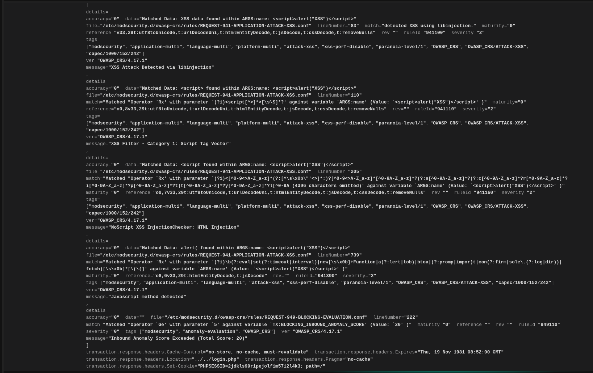

# RELATÓRIO - Defesa & Monitoramento  

    
**Nome:** Douglas Corrêa Rodrigues  

**Data:** 2025-09-23  

    

## 1\. Sumário Executivo

Neste projeto, criamos um ambiente de segurança digital para um site, usando um "guardião" chamado WAF (Web Application Firewall) para proteger contra ataques. Nós montamos um cenário de teste, agindo como atacantes para tentar invadir o site com ataques comuns, como os que roubam dados (SQL Injection) ou injetam códigos maliciosos (XSS).

No começo, o WAF apenas nos avisou sobre os ataques. Depois, nós o ativamos para bloquear tudo, e ele fez o trabalho. Conseguimos provar com prints e logs que as defesas funcionaram, mostrando que o site estava seguro e que tínhamos um plano para lidar com futuras ameaças.

## 2\. Objetivo e Escopo

O objetivo do exercício foi implementar e testar um sistema de defesa para uma aplicação web, simulando um ambiente de produção. O escopo do projeto incluiu:

  * **Defendido:** Uma aplicação web vulnerável (DVWA) rodando em um container Docker, protegida por um WAF ModSecurity e uma configuração de firewall.
  * **Atacado:** A superfície de ataque consistiu nas vulnerabilidades da aplicação web, como entradas de formulário e URLs, exploradas com ataques de **SQL Injection** e **XSS**.
  * **Limites do Exercício:** O foco foi em ataques de camada de aplicação (camada 7 do modelo OSI). Ataques de negação de serviço (DDoS) ou exploração de vulnerabilidades de sistema operacional não foram considerados. O ambiente foi isolado em containers Docker para este exercício.

## 3\. Arquitetura (Diagrama)

  * **Camadas e Fluxos:** O fluxo de tráfego começa na máquina de ataque (Kali), que envia requisições HTTP para o **Host de Defesa**, a máquina Linux que hospeda os containers. O tráfego chega primeiro ao host, onde as defesas da camada de rede estão, e depois é direcionado ao WAF (ModSecurity), que está rodando em um container.
O WAF inspeciona essas requisições. Se uma requisição for segura, ela é encaminhada para o DVWA, que também está em um container. Se for um ataque, o WAF pode registrá-lo ou bloqueá-lo. O Dozzle serve como uma interface de monitoramento para visualizar os logs gerados pelo WAF em tempo real.
## 4\. Metodologia

O projeto seguiu a seguinte metodologia:

1.  **Configuração do Ambiente:** Subiu-se o ambiente Docker com os containers Kali, DVWA, WAF ModSecurity e Dozzle.  O host de defesa foi endurecido com a aplicação de regras de firewall `iptables` para bloquear todo o tráfego de entrada por padrão e permitir apenas o tráfego necessário para a comunicação entre a máquina de ataque e os containers.
2.  **Hardening e Reconhecimento:** Executou-se um scan Nmap do container Kali para identificar os serviços expostos pelo WAF, confirmando que apenas o Nginx estava visível.
3.  **Modo de Detecção:** O WAF ModSecurity foi configurado para **`DetectionOnly`**. Ataques de SQLi e XSS foram executados para verificar se o WAF os identificava e registrava nos logs, sem impedir o acesso à aplicação.
4.  **Modo de Bloqueio:** A configuração do WAF foi alterada para **`On`**. Os mesmos ataques foram repetidos para comprovar que o WAF os bloqueava, retornando uma resposta HTTP 403.
5.  **Monitoramento e Evidências:** Durante as duas fases, os logs do WAF foram monitorados em tempo real usando o Dozzle e coletados para análise.
6.  **Resposta a Incidentes (NIST IR):** As etapas de resposta foram documentadas, mostrando a transição da detecção para o bloqueio.
7.  **Critérios de Sucesso:** O projeto foi considerado um sucesso quando os ataques de SQLi e XSS foram detectados e, posteriormente, bloqueados pelo WAF, com as evidências de logs e prints comprovando o processo.

## 5\. Execução e Evidências

### SQL Injection (SQLi) e Cross-Site Scripting (XSS)

  * **Detecção:** Conforme o log do Dozzle, no modo **`DetectionOnly`**, os ataques foram identificados.
      * **SQLi:** O WAF detectou a string de ataque `1' OR '1'='1'-- -` e ativou a regra `942100` (`SQL Injection Attack Detected via libinjection`).
      * **XSS:** O WAF detectou a string de ataque `` e ativou as regras `941100`, `941110`, `941160` e `941390` (`XSS Attack Detected`). 
  * **Prints:** A página de print do `nmap` confirma que a máquina Kali se conectou ao host de defesa e o identificou na porta 8080 com o serviço Nginx. 
  * **Resultados:** As requisições de ataque resultaram em um código HTTP `302`, indicando que o WAF detectou a ameaça, mas permitiu o redirecionamento.

### Modo Blocking (403 + logs CRS)

  * **Bloqueio:** No modo **`Enabled`**, as mesmas requisições de ataque foram imediatamente bloqueadas.
  * **Prints:** As capturas de tela mostram que as requisições de ataque de SQLi e XSS não deram resultados, e o log do Dozzle exibe o WAF retornando um código HTTP `403 Forbidden`.
  * **Logs CRS:** Os logs confirmam o bloqueio, exibindo o `secrules_engine` como **`Enabled`** e as mesmas regras de detecção de ataque (`942100` e `941100`) sendo ativadas, mas desta vez, resultando em um bloqueio (`http_code: 403`).

### Iptables/tcpdump, tuning, decisões

###

O **Host de Defesa** do ambiente é a máquina Linux subjacente que hospeda os containers Docker. Para aumentar a segurança, o sistema foi endurecido com a aplicação de regras de firewall **iptables**. As políticas padrão foram definidas para **`DROP`** todo o tráfego de entrada, bloqueando qualquer conexão que não seja explicitamente permitida.

As seguintes regras foram configuradas no `iptables` do host de defesa:

* **Permissão de Tráfego de Loopback:** Permitiu-se a comunicação interna (`-i lo`) do sistema.
* **Permissão de Tráfego Docker:** O tráfego da interface de rede do Docker (`-i docker0`) foi explicitamente permitido, garantindo que a comunicação entre o WAF, o DVWA e os outros containers pudesse ocorrer sem problemas.
* **Permissão para Acesso Web:** Foi aberta a porta `8080` para permitir que o tráfego HTTP da máquina de ataque chegasse ao WAF.

Esta configuração de firewall garante que apenas o tráfego essencial chegue aos serviços expostos, reduzindo drasticamente a superfície de ataque do host.

## 6\. Resposta a Incidente (NIST IR)

### 1\. Detecção

A atividade maliciosa foi detectada e analisada em tempo real através dos logs do WAF. As timestamps `23/Sep/2025:12:46:35` (SQLi) e `23/Sep/2025:12:46:46` (XSS) nos logs do WAF **evidenciam** que os ataques foram identificados, ativando as regras `942100` (SQL Injection) e `941100` (XSS).

### 2\. Análise

A análise dos logs forneceu os seguintes dados sobre o incidente:

  * **Tipo de Ataque:** SQL Injection e Cross-Site Scripting.
  * **Origem:** O endereço IP do atacante (Kali) era **`192.168.35.11`**.
  * **Alvo:** A aplicação web DVWA.
  * **Impacto:** Nenhum impacto na aplicação, pois o WAF estava em modo de detecção e não havia exposto dados sensíveis.

### 3\. Contenção

A medida de contenção imediata foi a alteração da configuração do WAF de **`DetectionOnly`** para **`Enabled`**. Isso foi feito no arquivo `docker-compose.yml`, uma mudança que colocou o WAF em modo de bloqueio, impedindo que os ataques continuassem a atingir a aplicação.

### 4\. Erradicação

A ativação do WAF em modo de bloqueio com o OWASP CRS **elimina** a vulnerabilidade na aplicação web do lado do servidor. Os ataques de SQLi e XSS subsequentes, realizados às `13:01:03` e `13:01:28` respectivamente, foram bloqueados com sucesso, **comprovando** a eficácia da erradicação.

### 5\. Recuperação

O ambiente foi considerado em estado de recuperação após a confirmação de que o WAF estava em pleno funcionamento, bloqueando os ataques e **assegurando que** a aplicação estava protegida contra essas ameaças. A capacidade de voltar à operação normal sem interrupção devido a um incidente é um ponto chave de recuperação.

### 6\. Lições Aprendidas

  * A principal lição foi a importância de ter um sistema de monitoramento para detectar e analisar incidentes rapidamente.
  * A capacidade de mudar rapidamente o WAF para um modo mais restritivo é uma ação de resposta a incidentes.
  * O WAF é uma camada extra de segurança, e a melhor prática é combinar isso com o Hardening do sistema e a correção das vulnerabilidades na aplicação.

## 7\. Recomendações (80/20)

| Ação | Esforço | Impacto |
| :--- | :---: | :---: |
| **Implementar Sistema de Alerta** Configurar alertas automáticos que notificam a equipe de segurança quando o score de anomalias ultrapassar um limite. | Baixo | Alto |
| **Automatizar a Resposta** Criar scripts que alteram a configuração do WAF para modo de bloqueio ao detectar um volume suspeito de ataques. | Médio | Alto |
| **Manter Regras do WAF Atualizadas** Garantir que o OWASP CRS e as regras do WAF sejam atualizados para proteger contra novas ameaças. | Baixo | Médio |
| **Fazer Hardening da Aplicação** Aplicar práticas de codificação segura (como `Prepared Statements` para SQLi e `HTML entity encoding` para XSS) na aplicação para corrigir as vulnerabilidades. | Alto | Alto |
| **Realizar Testes de Penetração Periódicos** Executar testes de penetração regulares para descobrir e corrigir vulnerabilidades. | Médio | Médio |

## 8\. Conclusão

Este projeto demonstrou de forma prática a importância de uma defesa em camadas. A implementação do WAF ModSecurity com OWASP CRS se mostrou uma barreira eficaz para mitigar ataques comuns como SQLi e XSS. A transição de detecção para bloqueio e a análise dos logs **comprovam** a capacidade de responder a um incidente de segurança de forma eficaz. Os próximos passos para aumentar a maturidade da segurança seriam focar na automação da resposta e na correção das vulnerabilidades na aplicação.

## Anexos

  * **Logs:**
      * [Logs do WAF em modo de detecção](logs_waf_evidenciasdetect.txt)
      * [Logs do WAF em modo de bloqueio](logs_waf_evidenciasbloc.txt)
  * **Prints:**
      * [Captura de tela da pagina de bloqueio](pagina.png)
      * [Captura de tela do `nmap`](print_nmap.png)
      * Capturas de tela do Dozzle mostrando logs de detecção: [Captura 1](print_detect1) - [Captura 2](print_detect2)
      * Capturas de tela do Dozzle mostrando logs de bloqueio (HTTP 403): [Captura 1](print_block1.png) - [Captura 2](print_block2.png)
